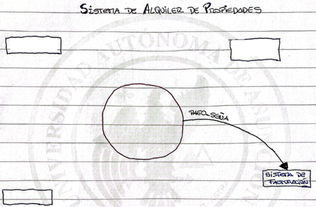
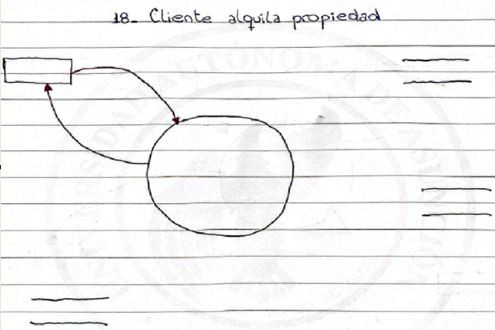
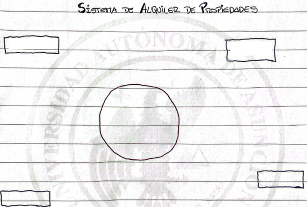
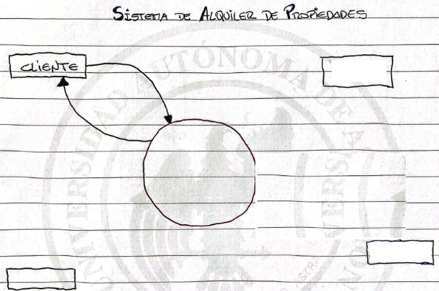
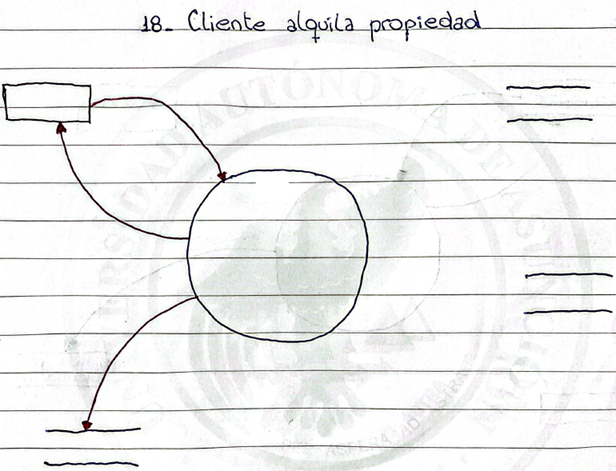

# Segunda prueba sumativa

## Caso práctico 

BajoPuente es una empresa dedicada al alquiler de propiedades urbanas y rurales, incluyendo casas, departamentos, depósitos y terrenos. El proceso de alquiler inicia cuando un cliente interesado se contacta a través del portal web o en forma presencial. Allí se registra su necesidad (tipo de inmueble, zona, precio estimado, duración del contrato) y se vincula con un asesor que filtra las opciones disponibles en la base de datos inmobiliaria. Esta base está actualizada en tiempo real y contiene información detallada de cada propiedad: ubicación, características, imágenes, precio, disponibilidad y tipo de contrato permitido.

Una vez seleccionado un inmueble de interés, se agenda una visita presencial o virtual. Si el cliente confirma su interés, se inicia el proceso administrativo: verificación de documentación (CI, comprobantes de ingresos, referencias personales/laborales), validación del perfil crediticio, y la firma digital o física del contrato. Todo este flujo se gestiona desde un módulo del sistema que almacena y verifica los documentos en línea, notifica automáticamente a las partes involucradas y genera un expediente único por cliente y propiedad.

Posteriormente, el sistema habilita el cobro de la seña o primer mes mediante pasarela de pagos integrada. Una vez procesado el pago, se activa la fecha de inicio del contrato, se emiten los documentos legales correspondientes (certificado de locación, póliza de seguro si aplica, cláusulas especiales), y se genera una agenda para la entrega de llaves, que queda registrada en el sistema como evento final del flujo. Todo el proceso queda auditado, lo que permite trazabilidad completa ante reclamos o controles legales.

## Cuestionario

Para el siguiente párrafo, es un evento correcto: es tiempo de imprimir contrato de cliente una vez procesado el pago de seña

> Posteriormente, el sistema habilita el cobro de la seña o primer mes mediante pasarela de pagos integrada. Una vez procesado el pago, se activa la fecha de inicio del contrato, se emiten los documentos legales correspondientes (certificado de locación, póliza de seguro si aplica, cláusulas especiales), y se genera una agenda para la entrega de llaves, que queda registrada en el sistema como evento final del flujo. Todo el proceso queda auditado, lo que permite trazabilidad completa ante reclamos o controles legales.

- [ ] Verdadero
- [x] Falso

**Si un terminador posible para el caso fuese el sistema de Facturación, ¿recomendarías un flujo de salida para indicar que el cliente acaba de abonar el pago de la seña, resolviendo lo que dice el usuario cuando menciona “el sistema habilita el cobro de la seña…”?**

- [ ] Verdadero
- [x] Falso

**El diccionario de datos se escribe todo en minúsculas, excepto:**

- [x] a. Nombre de la entidad
- [ ] b. Clave primaria
- [ ] c. Nombre del registro
- [ ] d. Clave secundaria
- [ ] e. Informes

**Indique qué paquetes de datos deberían ser parte del flujo de entrada para el siguiente diagrama de flujo de datos:**

- [ ] a. Login_contraseña_usuario
- [x] b. Datos_alquiler
- [ ] c. Cancelar_alquiler
- [ ] d. Forma_pago
- [x] e. Datos_cliente
- [x] f. CI

**¿Qué terminador debe estar presente en la declaración de objetivos?**

- [ ] a. Vendedor/Asesor
- [ ] b. Cliente
- [x] c. Ninguno de ellos
- [ ] d. Usuario
- [ ] e. Sistema de Facturación

**En la especificación de procesos para indicar la actualización del saldo, escribiría:**

- [ ] a. Saldo = débito – crédito
- [x] b. Actualizar saldo

**Indique de los siguientes eventos cuáles son de informe o consulta:**

> Posteriormente, el sistema habilita el cobro de la seña o primer mes mediante pasarela de pagos integrada. Una vez procesado el pago, se activa la fecha de inicio del contrato, se emiten los documentos legales correspondientes (certificado de locación, póliza de seguro si aplica, cláusulas especiales), y se genera una agenda para la entrega de llaves, que queda registrada en el sistema como evento final del flujo. Todo el proceso queda auditado, lo que permite trazabilidad completa ante reclamos o controles legales.

- [x] a. Usuario imprime documentos legales
- [ ] b. Usuario consulta pago de seña realizado por el cliente
- [x] c. Usuario imprime trazabilidad del proceso de alquiler por cliente
- [x] d. Usuario consulta llaves entregadas por rango de fechas
- [x] e. Usuario consulta agenda de entregas de llave al cliente

**Indique las alternativas posibles que escribiría dentro del círculo en el diagrama de contexto:**

- [x] a. Sistema de alquiler de propiedades
- [ ] b. Cliente alquila propiedades
- [ ] c. Registrar alquiler de propiedad
- [x] d. SAP Soft

**Ya que el sistema permite administrar los alquileres, ¿debería incluir el registro del pago para responder a la necesidad del usuario cuando menciona “el sistema habilita el cobro de la seña…”, en la declaración de objetivos?**

- [ ] Verdadero
- [x] Falso

**Si tuvieses que escribir la declaración de objetivos y como parte de ella, ¿qué acciones incluiría en la declaración de objetivos como para que determine el alcance del sistema?**

- [ ] a. Agendar visitas a la propiedad
- [ ] b. Generar contratos
- [ ] c. Habilitar cobros de seña
- [x] d. Controlar alquileres
- [ ] e. Registrar solicitudes realizadas por el cliente

**Indique qué terminador es el correcto para el siguiente diagrama de flujo de datos:**

- [ ] a. CONTRATO
- [x] b. Ninguno de los anteriores
- [ ] c. PROPIEDAD
- [ ] d. USUARIO
- [ ] e. SISTEMA DE ALQUILER

**El diccionario de datos se nutre de paquetes de datos provenientes de, selecciona el que corresponda:**

- [ ] a. Especificación de procesos
- [x] b. Diagrama de contexto
- [x] c. Diagrama de flujo de datos
- [ ] d. Declaración de objetivos
- [ ] e. Lista de eventos

**¿La especificación de procesos es como un lenguaje de programación?**

- [ ] Verdadero
- [x] Falso 

**Dado el siguiente párrafo, ¿cuáles son eventos correctos de actualización?**

> BajoPuente es una empresa dedicada al alquiler de propiedades urbanas y rurales, incluyendo casas, departamentos, depósitos y terrenos. El proceso de alquiler inicia cuando un cliente interesado se contacta a través del portal web o en forma presencial. Allí se registra su necesidad (tipo de inmueble, zona, precio estimado, duración del contrato) y se vincula con un asesor que filtra las opciones disponibles en la base de datos inmobiliaria. Esta base está actualizada en tiempo real y contiene información detallada de cada propiedad: ubicación, características, imágenes, precio, disponibilidad y tipo de contrato permitido.

- [x] a. Cliente alquila propiedad
- [ ] b. Usuario registra alquiler de casa, departamento, depósito o terreno
- [ ] c. Usuario registra cliente interesado para alquilar
- [ ] d. Cliente alquila casa
- [ ] e. Usuario registra alquiler de departamento

**La especificación de procesos lo hace:**

- [x] a. El analista
- [ ] b. El programador
- [ ] c. El diseñador

**La especificación de procesos se usa para:**

- [ ] a. Dar referencias al programador
- [ ] b. Crear pseudocódigo del programa
- [x] c. Indicarle al Diseñador qué hacer en el proceso
- [ ] d. Indicarle al Diseñador cómo debe hacerlo

**¿Qué eventos posibles se pueden deducir del siguiente párrafo?**

> BajoPuente es una empresa dedicada al alquiler de propiedades urbanas y rurales, incluyendo casas, departamentos, depósitos y terrenos. El proceso de alquiler inicia cuando un cliente interesado se contacta a través del portal web o en forma presencial. Allí se registra su necesidad (tipo de inmueble, zona, precio estimado, duración del contrato) y se vincula con un asesor que filtra las opciones disponibles en la base de datos inmobiliaria. Esta base está actualizada en tiempo real y contiene información detallada de cada propiedad: ubicación, características, imágenes, precio, disponibilidad y tipo de contrato permitido.

- [ ] a. Cliente realiza contacto vía Web
- [ ] b. Cliente realiza contacto presencial
- [x] c. Cliente solicita alquiler
- [x] d. Usuario mantiene propiedad en alquiler
- [x] e. Vendedor/asesor consulta solicitudes realizadas por el cliente
- [ ] f. Es tiempo de actualizar base de datos de propiedad en tiempo real
- [ ] g. Asesor filtra opciones disponibles en la base de datos
- [ ] h. Usuario mantiene datos personales del cliente

**Indique las entidades mínimas que deberían estar para el siguiente diagrama de flujo de datos:**

- [x] a. Cliente
- [x] b. Alquiler
- [x] c. Propiedad
- [ ] d. Moneda
- [ ] e. Caja
- [ ] f. Forma_pago

**¿Qué indica esta definición en el diccionario de datos?
alfanumerica = [“a” – “z” | “A” – “Z” | [0-9] | “ “ ]**

- [x] a. Que no acepta ñ en minúscula
- [x] b. Que no acepta Ñ en mayúscula
- [x] c. Que acepta números, letras minúsculas, letras mayúsculas y espacios
- [x] d. Que no acepta vocales en minúsculas acentuadas
- [x] e. Que no acepta vocales en mayúsculas acentuadas

**¿Qué debería ir dentro del círculo para el diagrama de flujo de datos?**

- [ ] a. 18- Cliente alquila propiedad
- [ ] b. Sistema de alquiler de propiedades
- [ ] c. Cliente confirma alquiler
- [x] d. 18- Registrar alquiler
- [ ] e. Usuario registra alquiler

**Si un terminador fuese Cliente, ¿qué paquetes de datos deberían estar como flujo de entrada?**

- [ ] a. Pago_seña
- [x] b. Solicitud_alquiler
- [x] c. Confirmacion_visita
- [x] d. Datos_cliente
- [ ] e. Llave
- [ ] f. Contrato
- [x] g. Documentos_alquiler
- [x] h. CI

**Indique el evento automático que se puede deducir del siguiente párrafo:**

> Una vez seleccionado un inmueble de interés, se agenda una visita presencial o virtual. Si el cliente confirma su interés, se inicia el proceso administrativo: verificación de documentación (CI, comprobantes de ingresos, referencias personales/laborales), validación del perfil crediticio, y la firma digital o física del contrato. Todo este flujo se gestiona desde un módulo del sistema que almacena y verifica los documentos en línea, notifica automáticamente a las partes involucradas y genera un expediente único por cliente y propiedad.

- [ ] a. Es tiempo de informar que cliente firmó digitalmente el contrato
- [x] b. Es tiempo de diaramente informar vía correo electrónico a las partes involucradas que la validación de toda la documentación fue exitosa
- [ ] c. Es tiempo de confirmar interés del cliente vía correo electrónico
- [ ] d. Es tiempo de agendar visita presencial o virtual con el cliente
- [ ] e. Es tiempo de generar expediente único por cliente y propiedad

**Indique cuál sería la declaración de objetivos apropiada para el caso:**

- [x] a. Controlar los alquileres otorgados a sus clientes de BajoPuente
- [ ] b. Gestionar alquileres, cobro de seña y generación de contrato para los clientes de BajoPuente
- [ ] c. Desarrollar un sistema de control de alquileres para BajoPuente
- [ ] d. Iniciar el alquiler una vez iniciado el proceso y pago administrativo para BajoPuente

**Los informes o consultas, como paquetes de datos, ¿deben definirse en el diccionario de datos?**

- [x] Verdadero
- [ ] Falso

**Para indicar que se leen los pagos por señas que realiza el cliente en el sistema de facturación, ¿es correcto poner la entidad PAGOS en el diagrama de contexto como entrada de información?**

- [x] Verdadero
- [ ] Falso

**¿La declaración de objetivos debería indicar claramente que el usuario solicita que el sistema tenga una versión Web cuando dice “cliente interesado se contacta a través del portal web o en forma presencial…”?**

- [ ] Verdadero
- [x] Falso

**Define la entidad cliente, como parte del diccionario de datos**

CLIENTES = { cliente }

**Si fuese correcto un flujo de salida hacia la entidad Alquiler, ¿qué indica que el flujo de salida no lleva ningún paquete de datos?**

- [ ] a. Que se elimina el registro completo
- [ ] b. No se conoce el nombre del paquete de datos
- [x] c. Que se actualiza el registro completo
- [ ] d. No es válida esa entidad
- [ ] e. Que no hay nada que actualizar

**¿Qué terminadores deberían estar como parte del diagrama de contexto?**

- [x] a. Cliente
- [ ] b. Sistema Inmobiliario
- [x] c. Usuario
- [x] d. Vendedor/Asesor
- [ ] e. Propiedad
- [ ] f. Contrato
- [x] g. Sistema de facturación

**La especificación de procesos se hace para los procesos de:**

- [x] a. De último nivel del diagrama de flujo de datos
- [ ] b. De primer nivel del diagrama de flujo de datos
